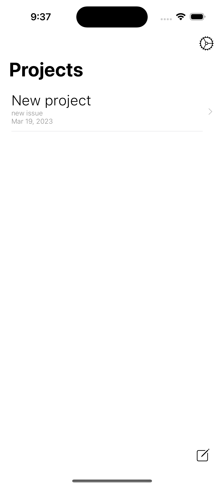
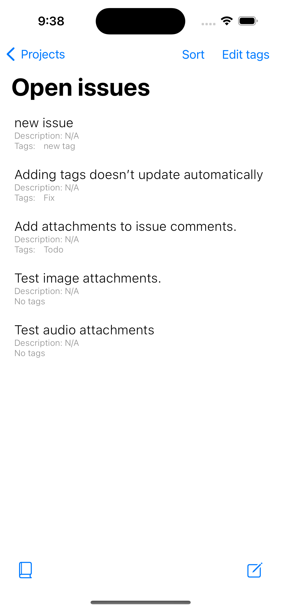
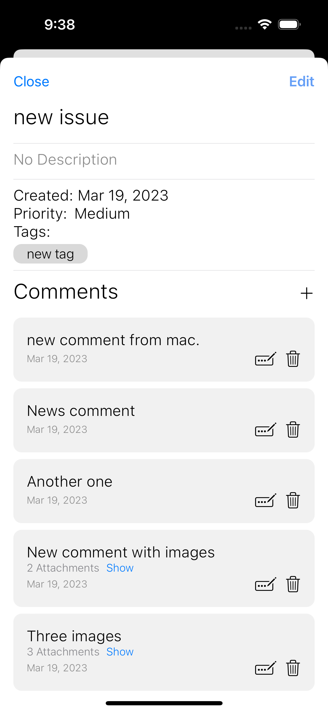

# Issue tracker
Simple issue tracker using CoreData and CloudKit.

## Libraries
- CoreData
- CloudKit
- AVFAudio (for audio attachments recording and playback)

## Features
- Creation of projects
- Opening and closing of issues
- Comments on issues
- Image and audio attachments on comments
- Future mac extension

## Pictures
| | |
| -- | -- |
|  |  |
|  | |